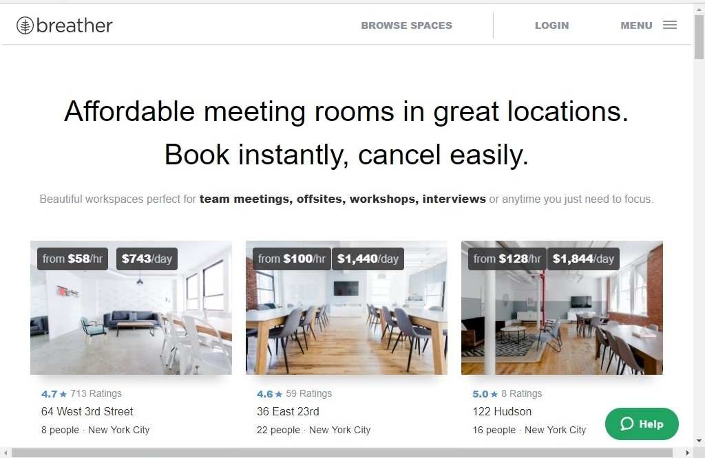
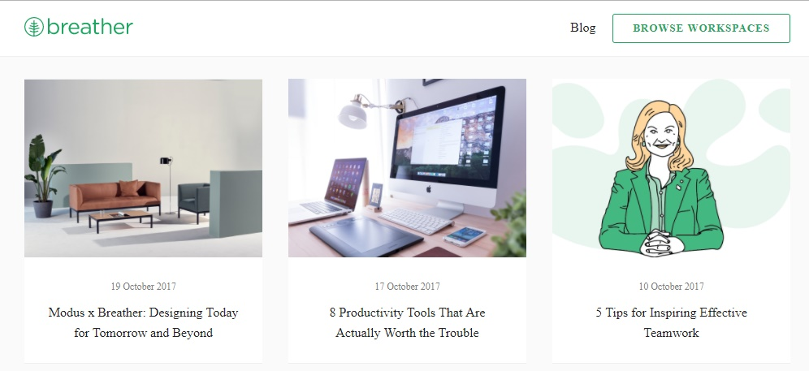
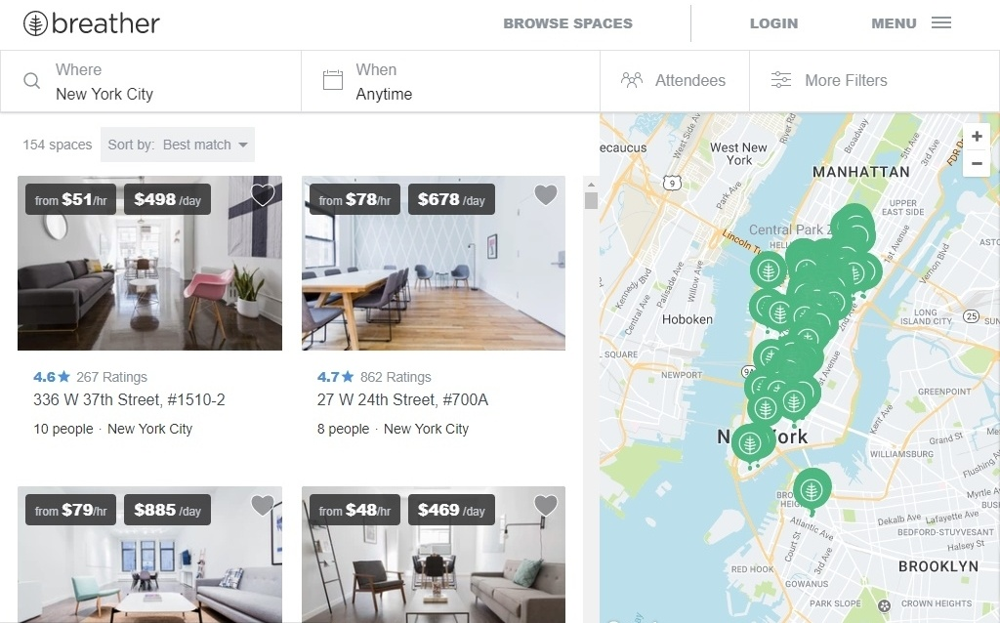
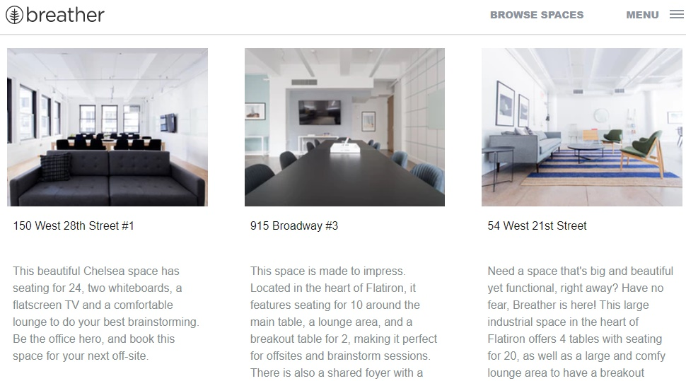
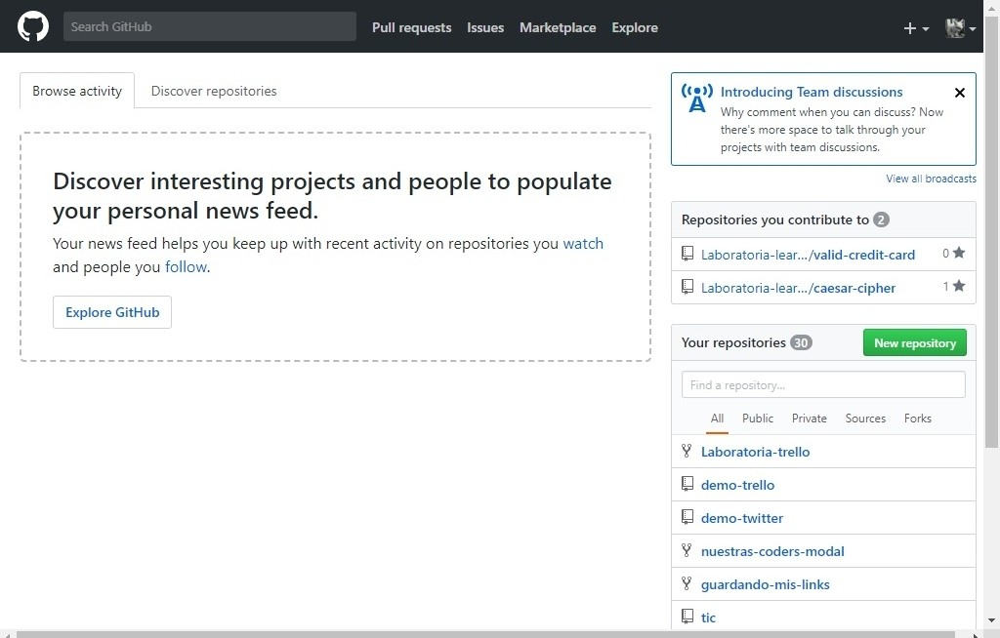
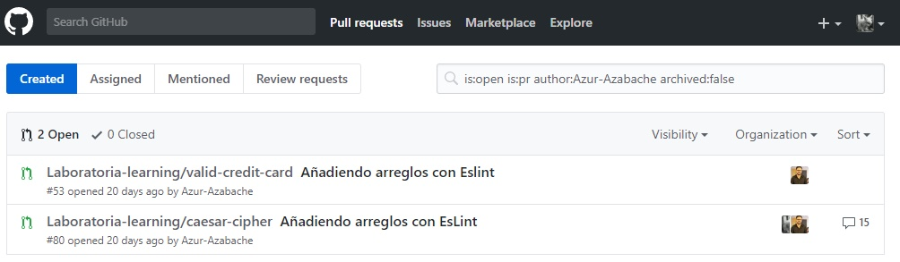
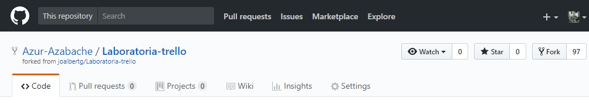
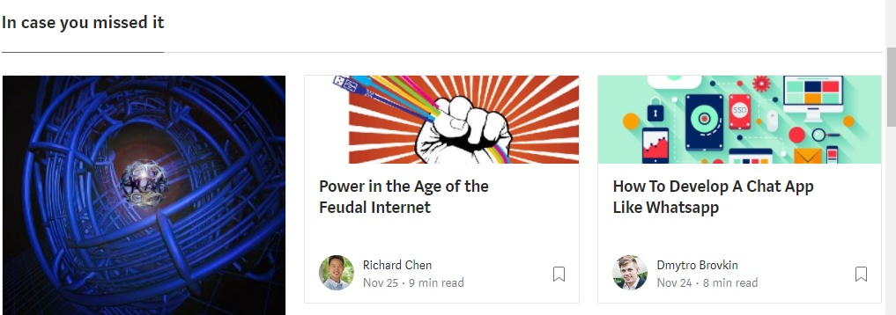

# Breather

Tipos de navegación vistos en la web:

- Global: Interfaz principal y opciones para navegar a través de la web.

- Local: Opciones que aparecen en otras vistas de la web y te facilitan el navegarla.

- Filtrada: Opción para colocar los filtros que consideres necesarios para hacer tu propia búsqueda.

- Inline: Aparición de links dentro de la web que te facilita el saber cierta información.

- Contextual: Aparición de noticias relacionadas o 'sugerencias' luego de haber hecho una búsqueda inicial.

# Github

Tipos de navegación vistos en la web:

- Global: Interfaz principal y opciones para navegar a través de Github.

- Local: Nuevas opciones para navegar a través de las vistas.

- Facetada: Filtros predeterminados por la página para facilitar la clasificación y navegación del usuario.

- Contextual: Aparecen sugerencias a medida que navegamos en la web.

# Medium

Tipos de navegación vistos en la web:

-  Global: Interfaz principal y opciones para navegar a través de Medium.

- Local: Nuevas opciones para navegar a través de las vistas.

- Contextual: Aparecen sugerencias a medida que navegamos en la web.

- Facetada: Filtros predeterminados por la página para facilitar la clasificación y navegación del usuario.

- Filtrada: Opción para colocar los filtros que consideres necesarios para hacer tu propia búsqueda.

